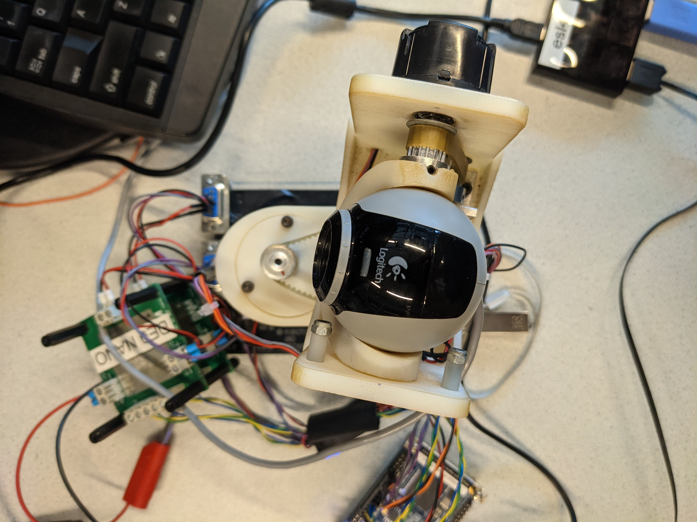

# Embedded Systems Laboratory
The goal of this practical work is to train in practical embedded system design, and to perform Design Space Exploration (DSE) to experience consequences of computer- architectural choices. The focus is on the embedded part of the cyber-physical system.

## Hardware:
Hardware used in the project:
- Altera DE0-NANO with Altera cyclone IV FPGA
- Gumstix Overo Fire with Arm Cortex A8 processor
- Ramstix (Overo FireStorm & FPGA on one board)
- Logitech C250 webcam
- Maxon DC motors
- Motor amplifier (H-Bridge)
- Encoder (angle sensor)

## Technologies:
Languages, libraries and versions used in the project:
- C
- GStreamer 1.0
- GStreamer App 1.0
- OpenCV2
- VHDL
- 20-Sim

## Authors:
- Glen te Hofsté
- Kilian van Berlo - s2613352 - k.vanberlo@student.utwente.nl

Project Link: https://github.com/KilianBerlo/Vision-In-The-Loop
